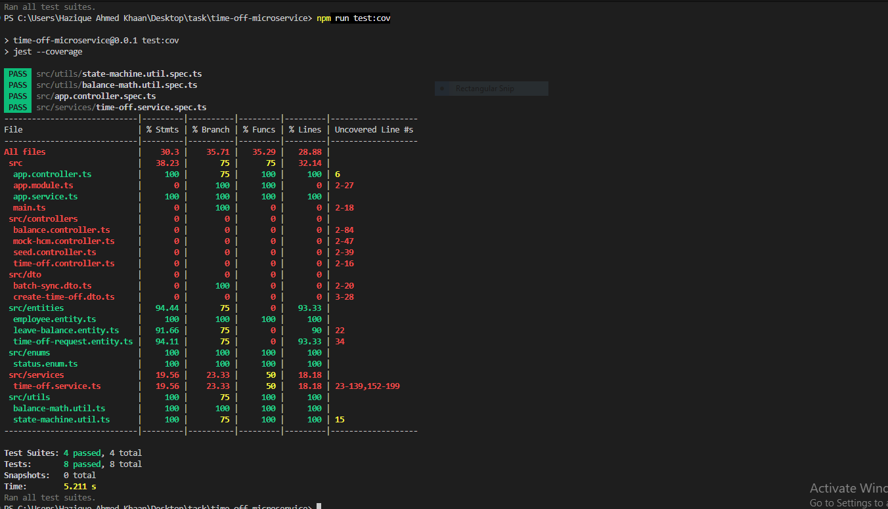

**Repository Link:** [https://github.com/Hazique7/Time-Off-Microservice-.git]

## 📄 Documentation & Engineering Spec
For a deep dive into the architecture, challenges, and alternatives considered during development, please read the:
👉 **[Technical Requirement Document (TRD)](./TRD.md)** 👈

# ExampleHR Time-Off Microservice

A robust, highly defensive NestJS microservice designed to manage employee time-off requests, 
balance deductions, and external HCM synchronization. 

This project was built to strictly adhere to the provided Technical Requirements Document (TRD),
focusing heavily on transactional integrity, floating-point safety, and state machine validations.

## 🏗️ Core Architectural Highlights

* **Fixed-Point Integer Arithmetic:** To prevent floating-point drift (e.g., `0.1 + 0.2 = 0.30000000000000004`), all balance calculations are performed using a custom `BalanceMath` utility that converts decimals to integer half-days before calculation.

* **Distributed Transaction Safety:** Network calls to the Mock HCM are deliberately placed *outside* of open database transactions
 to prevent hanging locks. If the HCM fails or rejects a request, an atomic rollback immediately refunds the integer balance.

* **Strict State Machine Guards:** Status transitions (e.g., `PENDING` -> `APPROVED` or `APPROVED` -> `CANCELLED`) are enforced
 via a whitelist. Invalid transitions instantly throw an HTTP 422 Unprocessable Entity.

* **Concurrency Handling:** The application leverages TypeORM query runners to wrap multi-step processes (like batch syncing and deductions) in atomic SQLite transactions. 
*(Note: While the TRD suggested `pessimistic_write` row-level locks, SQLite does not support this driver-level lock. Concurrency is handled via SQLite's native file-level transaction locking).*

*## 🚀 Getting Started*

### Prerequisites
* Node.js (v18+)
* npm

### Installation & Setup
1. Clone or extract the repository.
2. Install the dependencies:
   ```bash
   npm install

### Start the development server:
npm run start:dev
`The server will start on http://localhost:3000.`
TypeORM will automatically generate the exampleHR.sqlite database file on the first run.


*### How to Test*

To make evaluating this service as seamless as possible, a SeedController has been included to inject starting data so you can immediately test the endpoints.

*1. Seed the Database*
POST /seed
`Injects "Jane Doe" with a starting balance of 10.0 days.`

Note: Save the employeeId and locationId returned in the response for the following tests.

*2. Verify Live Balance*
`GET /balances/:employeeId/:locationId`
Fetches the current mathematical balance and the last HCM sync timestamp.

*3. Request Time Off (The Happy Path)*
POST /time-off
Validates the request (must be a multiple of 0.5), deducts the balance locally, and triggers the Mock HCM.

{
  "employeeId": "<SEEDED_EMPLOYEE_ID>",
  "locationId": "<SEEDED_LOCATION_ID>",
  "days": 2.5
}

*4. Test the Guardrails (Insufficient Funds)*
Try submitting the same request above, but ask for 15.0 days. The DTO validation and balance check will instantly reject it with an HTTP 422, ensuring the database is never touched.

*5. Cancel a Request*
`PATCH /time-off/:id/cancel`
(Requires the ID of the specific Time-Off Request, not the Employee ID).
Notifies the HCM of the cancellation and automatically refunds the 2.5 days back to the local integer balance.

*6. Batch Sync (The Override)*
`POST /balances/sync/batch`
Simulates a massive payload from the HCM. Overwrites local balances and automatically auto-rejects any currently PENDING requests that suddenly exceed the new authoritative balance limit.

{
  "balances": [
    {
      "employeeId": "<SEEDED_EMPLOYEE_ID>",
      "locationId": "<SEEDED_LOCATION_ID>",
      "balance": 15.0
    }
  ]
}

## 🧪 Proof of Coverage
Unit tests were written using Jest to ensure the custom integer-math utility, state machine guards, and core service logic are protected from future regressions.


